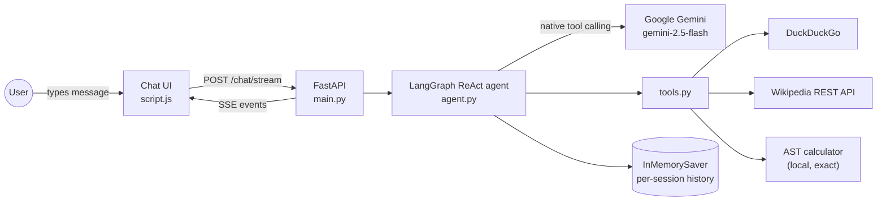

# 🤖 Smart Agent API

> An intelligent conversational agent powered by Google Gemini with native tool calling, live token streaming, and per-session conversation memory.

## ✨ What It Does

This agent can:
- 🔍 Search the web for real-time information (DuckDuckGo)
- 📚 Query Wikipedia for detailed knowledge
- 🧮 Perform exact calculations with a deterministic, AST-safe calculator (no LLM, no `eval`)
- 💬 Hold natural multi-turn conversations — it remembers context within a session
- ⚡ Stream replies token-by-token and show live tool steps in the UI

## 🏗️ Architecture



**Request flow:** the UI POSTs `{message, session_id}` to `/chat/stream`; the backend streams SSE events (`tool_start`, `tool_end`, `token`, `final`, `error`); the frontend renders tool chips and appends tokens live. Session history is stored server-side and keyed by `session_id`.

## 🚀 Quick Start

### 1. Install Dependencies
```bash
pip install -r requirements.txt
```

> **On a restricted network / package mirror?** If pip fails with `No matching distribution found for langchain>=0.3` (or `langgraph`), your index is missing the newer packages. Install the mirror-compatible subset instead — the app auto-detects it and runs through its OpenAI-compatible Gemini fallback tier (identical API, streaming, memory, and tools):
> ```bash
> pip install -r requirements-sandbox.txt
> ```

### 2. Pick an LLM Provider
The backend speaks the OpenAI protocol, so it runs on five interchangeable providers. Create `Backend/.env` (start from `Backend/.env.example`):

```env
# gemini (default) | groq | ollama | openrouter | cerebras
LLM_PROVIDER=groq
GROQ_API_KEY=your_key_here
```

| Provider | Required env | Free-tier notes |
| --- | --- | --- |
| **Google Gemini (AI Studio)** — default | `GOOGLE_API_KEY` | [aistudio.google.com/app/apikey](https://aistudio.google.com/app/apikey) — some models are limited to ~20 req/day free |
| **Groq** | `GROQ_API_KEY` | [console.groq.com/keys](https://console.groq.com/keys) — generous free limits, very fast |
| **Ollama** (local, offline) | none | [ollama.com](https://ollama.com) — `ollama serve` + `ollama pull llama3.1`, no key needed |
| **OpenRouter** | `OPENROUTER_API_KEY` | [openrouter.ai/keys](https://openrouter.ai/keys) — free models via `:free` suffixes |
| **Cerebras** | `CEREBRAS_API_KEY` | [cloud.cerebras.ai](https://cloud.cerebras.ai) — free tier, extremely fast inference |

Each provider ships with a sensible default model (`gemini-3.8-flash`, `qwen/qwen3.8-27b`, `llama3.1`, …); override it with `MODEL_NAME`. Switching provider = change one line and restart. Model catalogs drift — if a default 404s, list what your key can see (e.g. `GET https://api.groq.com/openai/v1/models`) and set `MODEL_NAME`.

### 3. Run the Backend
```bash
cd Backend
uvicorn main:app --reload
```

### 4. Open the Frontend
Check it's alive: `http://127.0.0.1:8000/health` → `{"status": "ok", ...}`. **Then open `http://localhost:8000` — the app now serves its own chat UI at the root**, so no separate static server is needed.

## 🛠️ Tech Stack

- **Backend**: FastAPI + LangGraph (prebuilt ReAct agent) + LangChain + pluggable LLM providers (Gemini AI Studio, Groq, Ollama, OpenRouter, Cerebras — all via OpenAI-compatible endpoints)
- **Frontend**: HTML, CSS, vanilla JavaScript (SSE reader)
- **Tools**: DuckDuckGo Search (`ddgs`), Wikipedia REST API, AST-safe calculator

## 🔌 API

| Endpoint | Method | Description |
| --- | --- | --- |
| `/chat/stream` | POST | Streaming chat (SSE). Body: `{"message": "...", "session_id": "..."}` |
| `/agent-chat` | POST | Legacy non-streaming JSON chat (same agent + memory) |
| `/health` | GET | Liveness + active provider & model (`ok` / `degraded`) |

### Execution tiers

The agent picks its runtime automatically at first use:

1. **`langgraph` tier** (default): LangGraph prebuilt ReAct agent + native Gemini tool calling, checkpointer-backed memory. Needs `langgraph` + `langchain-google-genai` from `requirements.txt`.
2. **`openai_compat` tier** (fallback, and the only tier for non-Gemini providers): a text-protocol tool loop over `ChatOpenAI` pointed at whichever provider is configured, with per-session chat history. Used when tier 1's packages aren't installed (e.g. restricted mirrors) or when `LLM_PROVIDER` isn't `gemini`.

Both tiers emit identical SSE events and share the same tools, rate limiting, and endpoints. The startup log line `Agent ready | mode=... provider=... model=...` shows which tier/provider is active.

### SSE event shapes

```jsonc
{"type": "tool_start", "tool": "duckduckgo_search", "label": "Searching the web", "args": {"query": "..."}}
{"type": "tool_end",   "tool": "duckduckgo_search", "label": "Searching the web", "summary": "…"}
{"type": "token",      "text": "partial answer…"}
{"type": "final",      "text": "the complete answer"}
{"type": "error",      "text": "friendly error message"}
```

## ⚙️ Configuration (Backend/.env)

| Variable | Default | Purpose |
| --- | --- | --- |
| `LLM_PROVIDER` | `gemini` | `gemini` \| `groq` \| `ollama` \| `openrouter` \| `cerebras` |
| `GOOGLE_API_KEY` | — | Gemini AI Studio key (required when provider is `gemini`) |
| `GROQ_API_KEY` | — | Groq key (required when provider is `groq`) |
| `OPENROUTER_API_KEY` | — | OpenRouter key (required when provider is `openrouter`) |
| `CEREBRAS_API_KEY` | — | Cerebras key (required when provider is `cerebras`) |
| `MODEL_NAME` | per-provider default | Override the provider's default model |
| `MODEL_TEMPERATURE` | `0.0` | Sampling temperature |
| `MODEL_REASONING_EFFORT` | `low` | Gemini-only thinking budget (`low` cuts latency; never sent to other providers) |
| `AGENT_MAX_ITERATIONS` | `8` | Cap on agent tool-call rounds |
| `CORS_ORIGINS` | localhost origins | JSON list of allowed origins |
| `RATE_LIMIT_PER_MINUTE` | `20` | Per-session request cap |
| `MAX_MESSAGE_CHARS` | `4000` | Input length cap |

## 🧪 Tests

```bash
pip install -r requirements-dev.txt
cd Backend
python -m pytest ../tests -q
```

62 tests cover the calculator (including unsafe-input rejection), the rate limiter, provider selection & per-provider agent construction, `/health`, both chat endpoints (with a stubbed agent — no network or API key needed), and SSE event ordering.

## 💡 Example Queries

- "What's the latest news about AI?"
- "Tell me about Albert Einstein" → then follow up: "and when did he die?" *(memory!)*
- "Calculate (1250 * 12) / 3 + sqrt(144)"

## 🤝 Contributing

Feel free to fork, improve, and submit pull requests!

---

Built with ❤️ using LangGraph and Google Gemini
